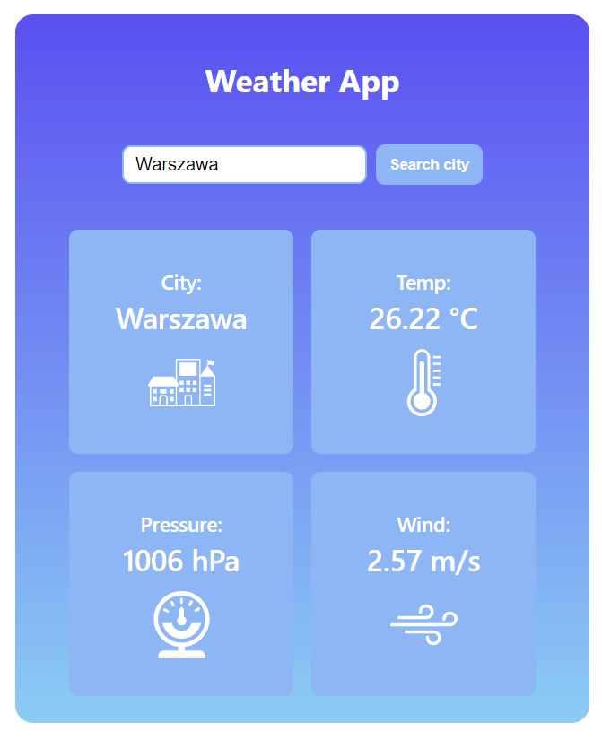
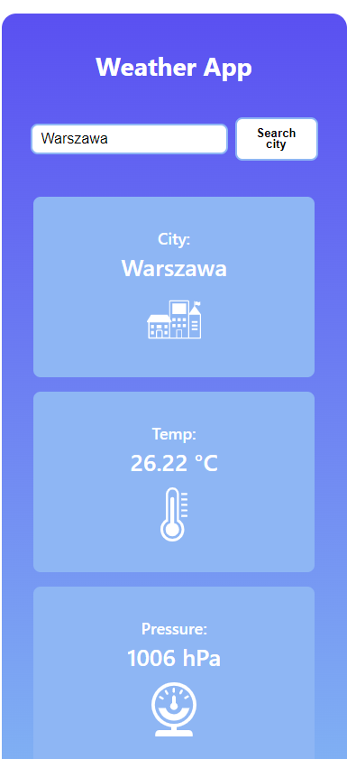

# Weather React App
Weather App written in React.
Source code from: Samuraj Programowania. Code changed and upgraded by me :).

# Getting Started with Create React App

This project was bootstrapped with [Create React App](https://github.com/facebook/create-react-app).

## Before start  
### Use `npm init`

## How to start?  
### Use `npm start`

Runs the app in the development mode.   
Open [http://localhost:3000](http://localhost:3000) to view it in the browser.

# Screenshots

* screenshots desktop   

 

* screenshots mobile  

 

# Live link
https://goldipl.github.io/ReactWeatherApp/