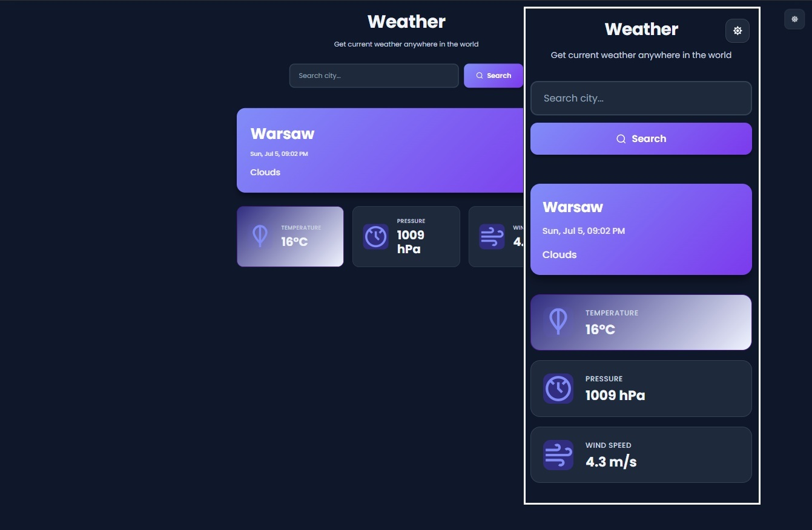

# Modern Weather App 🌤️

A beautifully designed, modern weather application built with React and featuring a stunning dark/light mode toggle. Get real-time weather information from anywhere in the world with a sleek, responsive UI.

## ✨ Features

- **Modern UI/UX Design** - Built with 2026-style design principles
- **Light & Dark Mode** - Seamless theme switching with smooth transitions
- **Real-time Weather Data** - Powered by OpenWeatherMap API
- **Responsive Design** - Works perfectly on desktop, tablet, and mobile
- **Smooth Animations** - Delightful micro-interactions and transitions
- **Beautiful Typography** - Google Fonts integration (Poppins)
- **Loading States** - Visual feedback during API calls
- **Error Handling** - User-friendly error messages
- **Modern React Hooks** - Uses functional components with React Hooks
- **Glass-morphism Effects** - Modern design aesthetic

## 📁 Project Structure

```
src/
├── App.js                 # Main application component
├── App.css               # Application styles with theme variables
├── index.js              # React entry point
├── index.css             # Global styles & Google Fonts
└── components/
    ├── SearchSection.js  # Search input component
    ├── WeatherOutput.js  # Weather display component
    └── ThemeToggle.js    # Dark/light mode toggle
```

## 🖼️ Screenshot



## 🚀 Getting Started

### Prerequisites

- Node.js (v14 or higher)
- npm or yarn

### Installation

1. **Create a new React app** (if you don't have one):

   ```bash
   npx create-react-app weather-app
   cd weather-app
   ```

2. **Replace the src folder** with the provided files

3. **Install dependencies** (should be pre-installed):

   ```bash
   npm install
   ```

4. **Start the development server**:

   ```bash
   npm start
   ```

5. **Open in browser**: The app will automatically open at `http://localhost:3000`

## 🎨 Design Features

### Color System

- **Light Mode**: Clean whites, grays, and indigo accents
- **Dark Mode**: Deep blues and grays for reduced eye strain
- **Dynamic Theme Colors**: All colors adapt based on theme

### Typography

- **Font**: Poppins (from Google Fonts)
- **Weights**: 400 (regular), 500 (medium), 600 (semibold), 700 (bold)
- **Sizes**: Responsive scaling for all screen sizes

### Animations

- Smooth slide-in animations for content loading
- Hover effects on cards and buttons
- Loading spinner during API requests
- Elegant transitions throughout the app

### Responsive Breakpoints

- Desktop: 1024px and above
- Tablet: 768px - 1023px
- Mobile: Below 768px
- Small Mobile: Below 480px

## 🔑 API Configuration

The app uses the **OpenWeatherMap API**. The API key is included in the code, but you should replace it with your own:

1. Go to [OpenWeatherMap](https://openweathermap.org/)
2. Sign up for a free account
3. Get your API key from the dashboard
4. Replace the API key in `App.js`:

```javascript
const API = `https://api.openweathermap.org/data/2.5/weather?q=${value}&APPID=YOUR_API_KEY&units=metric`;
```

## 🎯 Component Details

### App.js

- Main component managing state and API calls
- Handles theme switching
- Manages loading states
- Coordinates between child components

### SearchSection.js

- Search input field with placeholder
- Responsive button with loading state
- Form submission handling
- Built-in search icon SVG

### WeatherOutput.js

- Displays weather information in cards
- Shows empty state when no search performed
- Displays error messages for invalid cities
- Responsive grid layout for weather cards

### ThemeToggle.js

- Fixed position button (top-right)
- Sun/moon icon switching
- Smooth theme transition
- Accessible via keyboard

## 🛠️ Customization

### Change Primary Color

Update the `--accent-primary` and related variables in `App.css`:

```css
:root {
  --accent-primary: #6366f1; /* Change this color */
}
```

### Adjust Spacing

Modify padding and margins throughout by updating CSS values in component styles.

### Change Font

Replace the Google Fonts import in `index.css` with your preferred font:

```css
@import url("https://fonts.googleapis.com/css2?family=YOUR_FONT&display=swap");
```

## 📱 Browser Support

- Chrome/Edge (latest)
- Firefox (latest)
- Safari (latest)
- Mobile browsers (iOS Safari, Chrome Mobile)

## 🐛 Troubleshooting

### App shows "We couldn't find..." error

- Check if the city name is spelled correctly
- Some small cities might not be in the database
- The API might be rate limited (free tier has limits)

### API Key issues

- Verify your API key is valid
- Check if your API key has permissions for weather data
- Ensure the API key is correctly placed in the code

### Theme not switching

- Clear browser cache
- Check if localStorage is enabled
- Try reloading the page

## 📦 Dependencies

- React 18+
- ReactDOM 18+
- No external UI libraries (custom CSS)
- Vanilla JavaScript for API calls

## 🌐 Live Data

Weather data is fetched from the **OpenWeatherMap API** which provides:

- Current temperature
- Atmospheric pressure
- Wind speed
- Weather description
- Time of data update

## 💡 Tips

1. **Search Efficiency**: The app converts temperatures to Celsius automatically
2. **Keyboard Navigation**: Use Tab to navigate and Enter to search
3. **Offline Check**: The app requires internet to fetch weather data
4. **Mobile Optimization**: Use the responsive design by resizing your browser

## 📄 License

This project is free to use and modify for personal and commercial purposes.

## 🎉 Enjoy!

Have fun using the modern weather app! For questions or improvements, feel free to customize the code to your needs.

---

**Built with ❤️ using React and modern web design principles**
